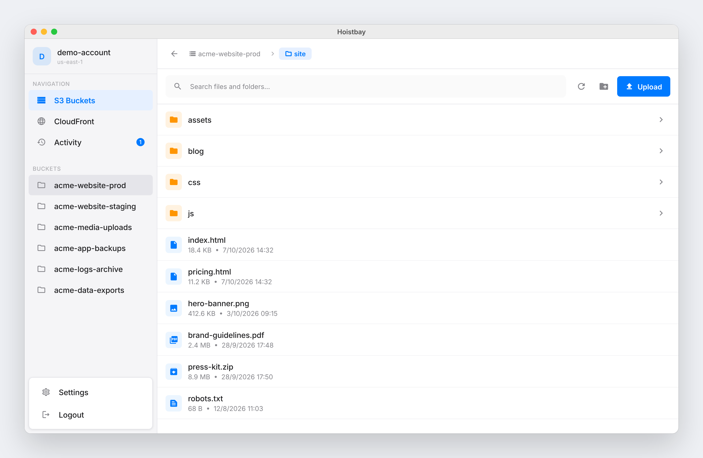

# Hoistbay

<div align="center">


**Hoistbay — a free, open-source desktop app for Amazon S3 and CloudFront.**
Your keys stay in your OS keychain, and the app talks to nobody but AWS.

[](https://github.com/mekartikshah/hoistbay/releases/latest)
[](https://github.com/mekartikshah/hoistbay/actions/workflows/build.yml)
[](LICENSE)
[](CONTRIBUTING.md)

[Download](#-download) • [Features](#-features) • [Security](#-security) • [Build from source](#-build-from-source)

</div>



## ⬇️ Download

| Platform | Download | Notes |
| --- | --- | --- |
| macOS 12+ (Apple Silicon & Intel) | [**Hoistbay-macOS.zip**](https://github.com/mekartikshah/hoistbay/releases/latest/download/Hoistbay-macOS.zip) | Unzip and move **Hoistbay** to Applications |
| Windows 10/11 (x64) | [**Hoistbay-Windows.zip**](https://github.com/mekartikshah/hoistbay/releases/latest/download/Hoistbay-Windows.zip) | Unzip and run `hoistbay.exe` |
| Linux | Coming soon | Watch the repo to get notified |

All versions and release notes: [Releases](https://github.com/mekartikshah/hoistbay/releases) · [CHANGELOG](CHANGELOG.md)

### Opening the app the first time

The builds are not code-signed yet, so your OS will ask before opening them.

- **macOS:** right-click **Hoistbay** in Applications → **Open** → **Open**. If you only see "Move to Trash", go to **System Settings → Privacy & Security** and click **Open Anyway**. You only need to do this once.
- **Windows:** if SmartScreen shows "Windows protected your PC", click **More info → Run anyway**.

Prefer to verify everything yourself? [Build from source](#-build-from-source) — it takes a few minutes.

## ✨ Features

- 🔄 **Multiple AWS profiles** — switch accounts and regions instantly; session tokens supported; bucket regions auto-detected (no more `SignatureDoesNotMatch`).
- 📁 **Browse and search buckets** — breadcrumbs, grid/list views, multi-select, pagination past 1,000 objects.
- ⬆️ **Uploads** — files, multiple folders, or drag and drop, with folder structure preserved and progress shown.
- ⬇️ **Downloads** — single objects or whole folders.
- ✂️ **Bulk operations** — rename, move, delete (including folders), and copy across buckets and regions.
- 🛠️ **Default HTTP header rules** — per-bucket rules by file pattern (e.g. `*.js` → `Cache-Control: max-age=31536000`) applied automatically on upload.
- 🔍 **Object inspector** — properties, HTTP headers, `x-amz-meta-*` metadata, tags and versions; edit metadata inline.
- ⚡ **CloudFront** — view distributions and clear the cache (create invalidations) without leaving the app.
- 📋 **Activity panel** — live status and history for uploads, downloads, deletes and invalidations, with automatic retries.

## 🔒 Security

Hoistbay has no backend and no telemetry.

- **Local credential storage:** keys are stored with `flutter_secure_storage`, which uses the macOS Keychain or Windows Credential Manager.
- **Direct to AWS:** the app calls official AWS regional endpoints over HTTPS. Nothing is sent anywhere else.
- **Open source:** every line is here to audit, under the MIT license.

**Tip:** use an IAM user or role with only the permissions you need. For read-only browsing, `s3:ListAllMyBuckets`, `s3:GetBucketLocation`, `s3:ListBucket` and `s3:GetObject` are enough; add `s3:PutObject` / `s3:DeleteObject` for uploads and deletes, and `cloudfront:ListDistributions`, `cloudfront:CreateInvalidation` and `cloudfront:GetInvalidation` for CloudFront.

## 🚀 Build from source

**Prerequisites:** [Flutter](https://docs.flutter.dev/get-started/install) (latest stable), and Xcode (macOS) or Visual Studio with the C++ desktop workload (Windows).

```bash
git clone https://github.com/mekartikshah/hoistbay.git
cd hoistbay
flutter pub get

# Run in debug
flutter run -d macos     # or: flutter run -d windows

# Release build
flutter build macos      # or: flutter build windows
```

## 🛠️ Tech stack

- **Framework:** Flutter (desktop)
- **State management:** Provider
- **AWS SDK:** `aws_s3_api`, `aws_cloudfront_api`, with a custom Signature V4 fix for keys containing special characters
- **Secure storage:** `flutter_secure_storage`

## 🤝 Contributing

Bug reports, feature ideas and pull requests are welcome — see [CONTRIBUTING.md](CONTRIBUTING.md).

1. Fork the project
2. Create a feature branch (`git checkout -b feature/amazing-feature`)
3. Commit your changes
4. Push the branch and open a pull request

## 📝 License

Distributed under the MIT License. See [LICENSE](LICENSE).

## 💖 Support

If Hoistbay saves you time, please ⭐ the repo and share it with a teammate who lives in the AWS console. You can also [buy me a coffee](https://buymeacoffee.com/kartikshah).

## ⚖️ Trademarks

Hoistbay is an independent open-source project and is not affiliated with, sponsored or endorsed by Amazon Web Services. Amazon S3, Amazon CloudFront and AWS are trademarks of Amazon.com, Inc. or its affiliates.

---

<div align="center">
Built with ❤️ for the AWS community by <a href="https://github.com/mekartikshah">Kartik Shah</a>
</div>
